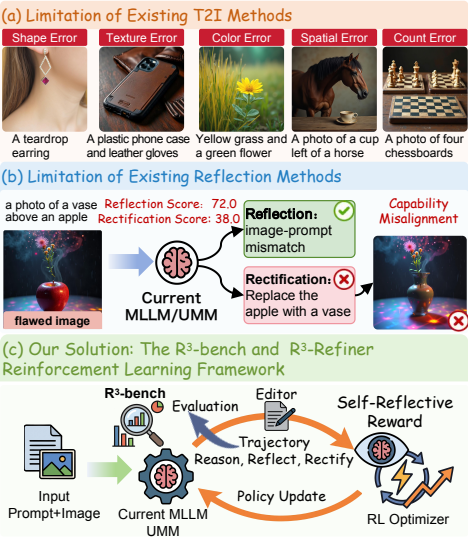
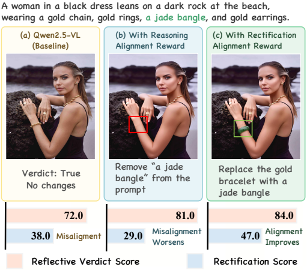
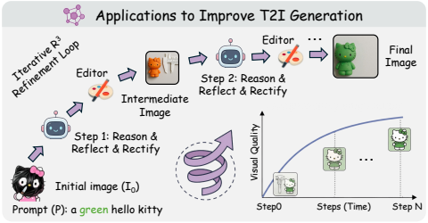

# R3-Gen

Official code release for **R3-Gen: Reason, Reflect, Rectify for Reflective Visual Generation**.

R3-Gen trains a reflective vision-language policy with online image-edit rollouts and reward feedback. The training process is built around three pieces:

<p align="center">
  
</p>

- `verl/`: the GRPO training loop, multimodal data loader, FSDP workers, vLLM rollout, reward manager, and checkpoint utilities.
- `examples/`: prompt templates and staged reward functions used by the policy.
- `distributed_services/`: HTTP services and clients for image editing and reward scoring. Editing and reward models are served as long-running processes and are called by the training reward function through endpoints.

Models, datasets, checkpoints, generated images, logs, W&B runs, and analysis scripts are intentionally not included.

## Environment

The original experiments used Linux, Python 3.10, CUDA GPUs, Ray, PyTorch/FSDP, vLLM, and Transformers. Install the Python dependencies with:

```bash
pip install -r requirements.txt
pip install -e .
```

Some optional services require extra model-specific dependencies:

- BAGEL edit server: BAGEL runtime and model weights.
- Qwen image-edit server: `diffusers` with Qwen-Image-Edit support and optional `cache-dit`.
- SAM3 reward server: SAM3 package and checkpoints.

## Prepare Data

Place your training JSON files and images outside the repository or under `examples/data/` locally. They are ignored by git. See [examples/data/README.md](examples/data/README.md) for the expected schema.

Typical variables:

```bash
export TRAIN_DATA_PATH=/path/to/train.json
export VAL_DATA_PATH=/path/to/val.json
export IMAGE_DIR=/path/to/images
export MODEL_PATH=/path/to/policy_or_base_vlm
```

## Start Services

Edit `distributed_services/config/config.yaml` or export equivalent environment variables for local model paths.

Start an image-edit service on an edit node:

```bash
export EDIT_MODEL_PATH=/path/to/BAGEL-7B-MoT
bash distributed_services/scripts/deploy_services.sh edit_server "$EDIT_MODEL_PATH" bagel
```

Start an OmniVerifier/R3-Gen reward service on a reward node:

```bash
export OMNIVERIFIER_MODEL_PATH=/path/to/reward_model
export REWARD_TYPE=omniverifier
bash distributed_services/scripts/deploy_services.sh reward_server
```

Generate endpoint environment variables for the training node:

```bash
bash distributed_services/scripts/deploy_services.sh get_config
source distributed_services/config/service_endpoints.env
```

More details are in [docs/SERVICES.md](docs/SERVICES.md).

## Train

Run the default VLM training entry:

```bash
export MODEL_PATH=/path/to/policy_or_base_vlm
export TRAIN_DATA_PATH=/path/to/train.json
export VAL_DATA_PATH=/path/to/val.json
export IMAGE_DIR=/path/to/images

bash distributed_services/scripts/train_quick.sh
```

Common overrides:

```bash
export PROJECT_NAME=R3-Gen
export EXPERIMENT_NAME=r3-gen-grpo
export N_GPUS_PER_NODE=8
export ROLLOUT_BATCH_SIZE=128
export FORMAT_PROMPT=examples/format_prompt/qwen3_vl_edit_optimized.jinja
export REWARD_FUNCTION=examples/reward_function/qwen3vl_staged_reward_api.py:compute_score
```

For a LLaVA-OneVision policy, use:

```bash
bash distributed_services/scripts/train_llava_onevision.sh
```

## R3-Bench

<p align="center">
  
</p>

## R3-Refiner

<p align="center">
  
</p>

## Reward Design

<p align="center">
  
</p>

## Iterative Refinement

<p align="center">
  
</p>

## Qualitative Examples

<p align="center">
  
</p>

## Repository Layout

```text
R3-Gen/
├── distributed_services/
│   ├── clients/          # endpoint client, load balancing, health checks
│   ├── config/           # public-safe default configs and endpoint templates
│   ├── scripts/          # service deployment and training launchers
│   ├── servers/          # edit and reward HTTP servers
│   ├── bagel_deps/       # lightweight BAGEL server-side code dependencies
│   └── sam3_deps/        # optional SAM3 reward helpers
├── examples/
│   ├── format_prompt/    # chat/prompt templates
│   └── reward_function/  # staged reward functions
├── tools/                # local utilities
└── verl/                 # training framework
```

## Notes

- Do not commit model checkpoints or datasets. The `.gitignore` excludes the usual local artifact paths.
- The edit and reward services expose `/health`; the training client periodically checks endpoints and reloads `service_endpoints.env`.
- The staged reward functions call image-edit and reward services only when the endpoint environment variables are configured.
